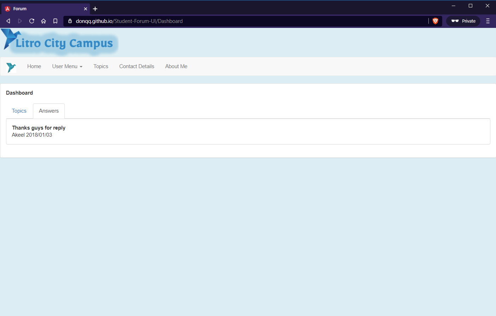
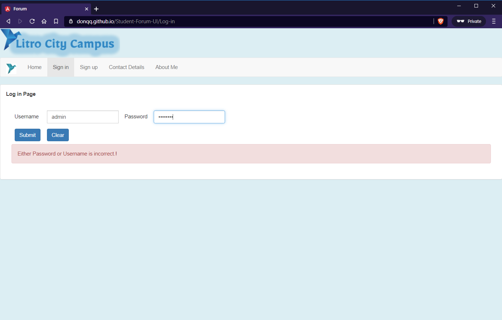
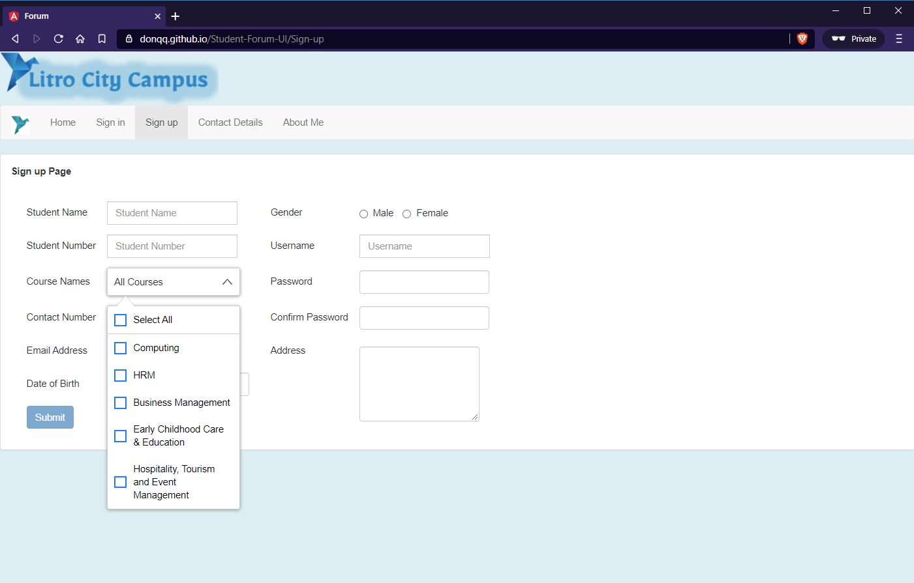
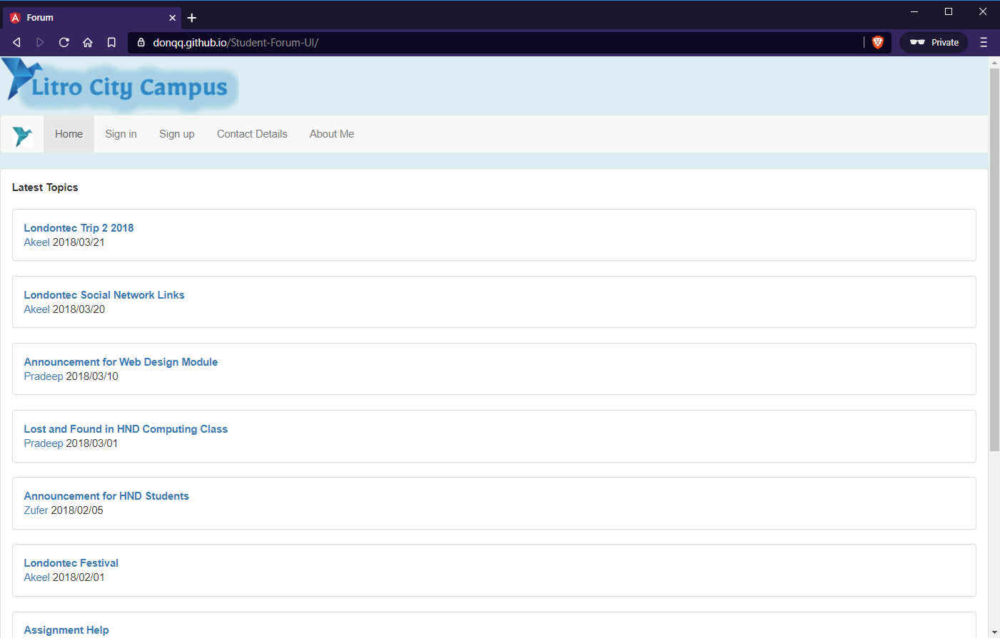
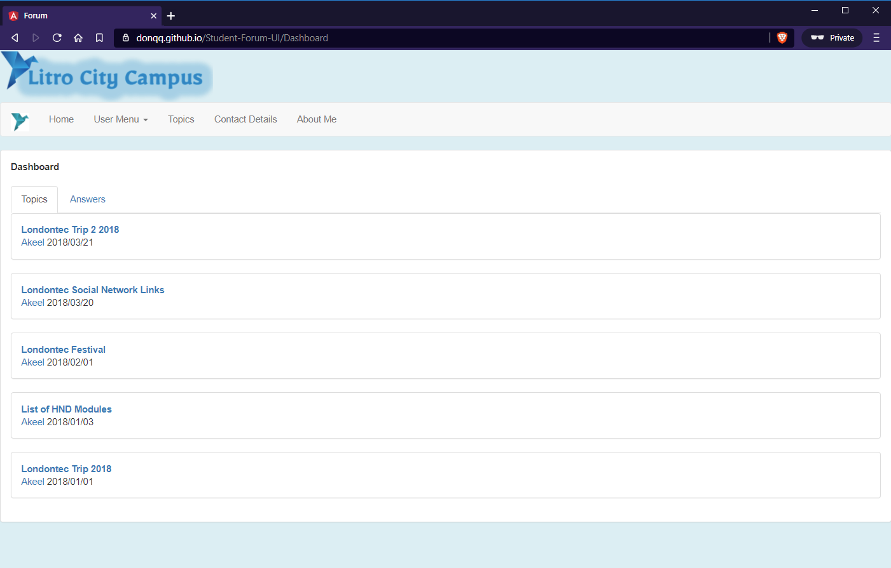
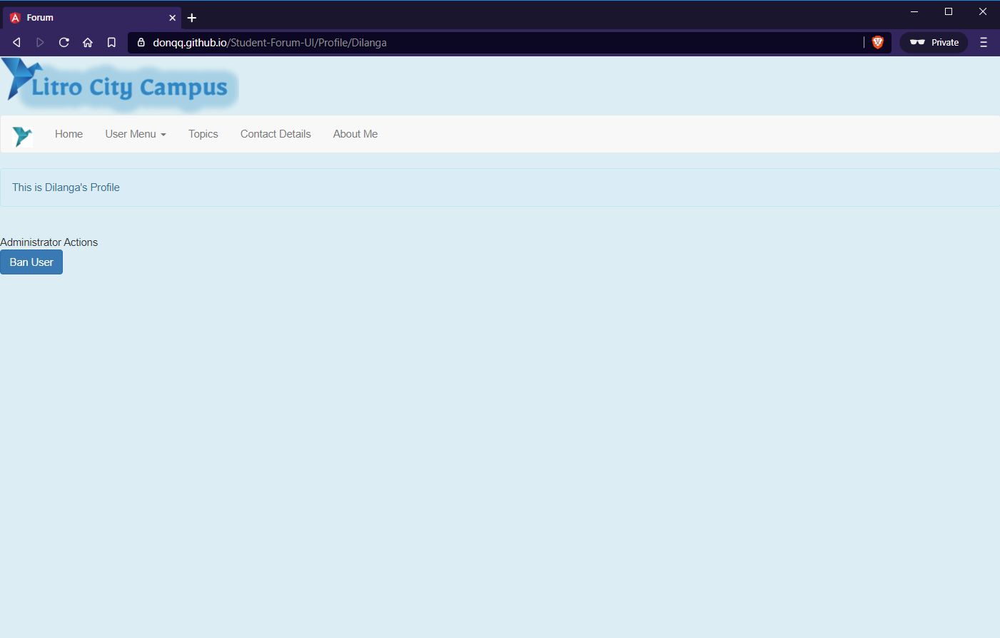
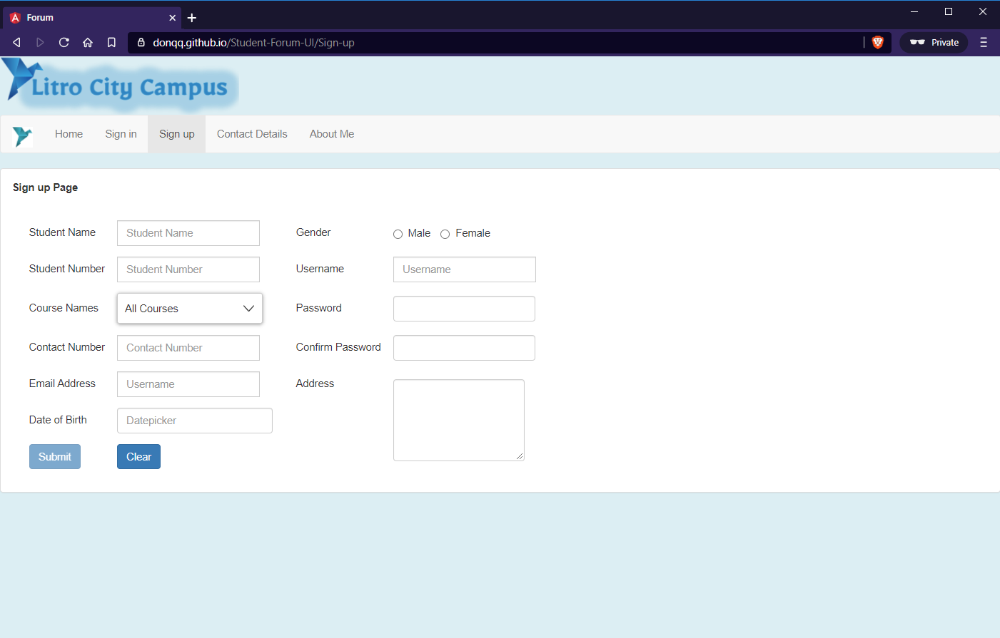
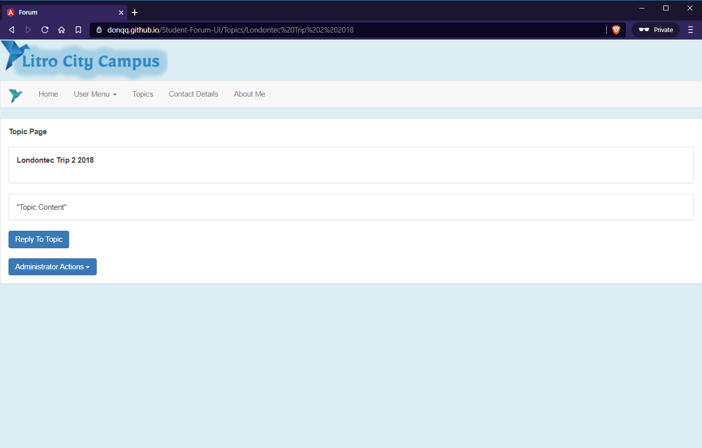
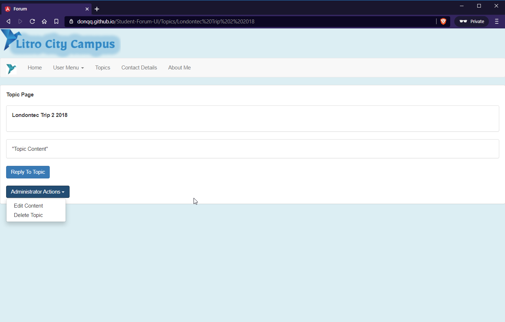

# Student Forum UI
Student Forum UI is an User Interface developed in Angular with the capability to validate user inputs in the client side.

# Version
v0.1 Beta

# Requirements
- Visual Studio Code

# Features
- Responsive UI (Support both Mobile, and Desktop)
- User Validation

# Installation
- Download the app (Code -> Download ZIP)
- Extract the archive to anywhere in the file system
- Open the root folder via Visual Studio Code
- Type npm install to install the required packages
- Run the project as ng serve, if it works properly, then proceed to the next step
- Build the project as ng build --prod
- Upload the project to your server

# Used Technologies
- Angular
- Typescript
- Javascript
- NGX-Bootstrap
- Angular X Multiselect Dropdown

## Developer
Badde Liyanage Don Dilanga, 2020/October, github@dilanga.com.
Sri Lanka LK. 

## License
Simple non code license (SNCL)

#### Can
 - Distribute
 - Modify
#### Cannot
 - Commercial Use
 - Hold Liable
 - Use Trademark
#### Must
 - Include Copyright
 - Include Notice
 - Include License
 - Give Credit
  

# Screenshots
       

# Demo
https://donqq.github.io/Student-Forum-UI/
